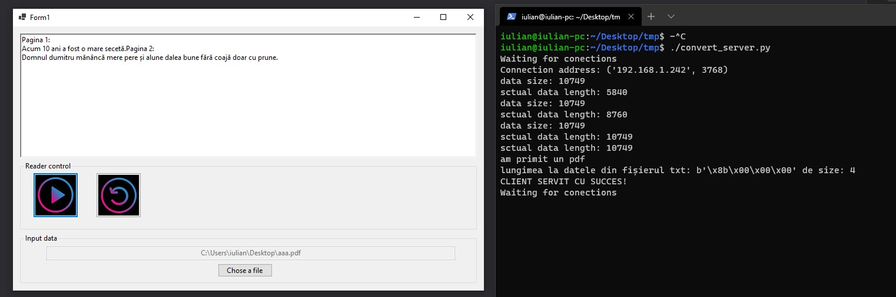

# eBookReADER
 Is an app that read your electronic books, the formats accepted are:

      - pdf
      - docx
      - txt(plain text)

In order to convert the docx/pdf to txt files I used a custom TCP server writen in python named **convert_server.py**, în c# I send the file to server to get the  plain text from input file.

After file conversion is complete the text is sent to Google Text-to-Speech API in order to obtain am .mp3 file coresponding to previous text file, and the last step is do play the audio file to user. The GUI is made using WinForms.

Os interaction si made trough socket creation used to talk to convert server

In order to run it you need to folow this steps:
 
 -you need to set GOOGLE_APPLICATION_CREDENTIALS environment variable to path of <file>.json which contains you private key for google TTS
 -after that you need to start the convert_server.py (require python 3.x in order to run)
 -run the eBookReader.exe from eBookReader/bin/Debug/netcoreapp3.1 (if you hav any error make sure that ip variable from eBookReader/Form1.cs:50 has the ip adress of the server where convert_server.py is runing, by default the ip is set to "192.168.1.243")

TO DO:
 
      - add more error handling;
      - add save audio books to internal storage feature;
      - optimize both convert server and client;

Optional tasks:

  - display mp3 playesr status;
  - add suport for both EN and RO languages(curently only RO is suported);  
  - give user posibilyty to skip to a specific point into audio file;
  
Here is a screenshoot of app GUI:

